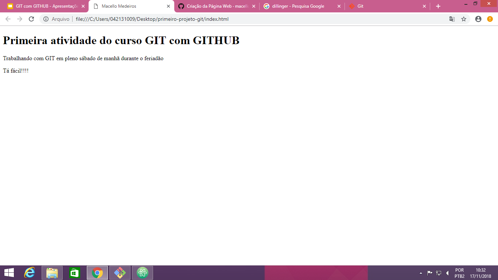

# Primeira atividade do curso de GIT com GITHUB

Atividade realizada no dia 17 de novembro de 2018 na UNIFACS Paralela!

- Desenvolvedor: Macello Medeiros
- Instrutor: Victor Romário

### Descrição
> Página simples em html com objetivo de exemplificar a alteração, criação e submissão de u projeto ao GITHUB com GIT.

Tecnologias utilizadas no projeto
* HTML
* [GIT] (https://git-scm.com/)
* Markdown

### Comandos dos GIT aprendidos até aqui

```sh
$ git config --global user.name "seu nome"
$ git config --global user.email seu@email
```
Após a criação da pasta do projeto no computador

```sh
$ cd Desktop/primeiro-projeto-git
$ git init
$ git status
$ git add .
$ git commit -m "mensaqgem"
$ git log
```
Submissão para o GITHUB
```sh
$ git remote add origin endereçoHTTPSdorepositório
$ git push -u origin master
```

### Imagem da Página

